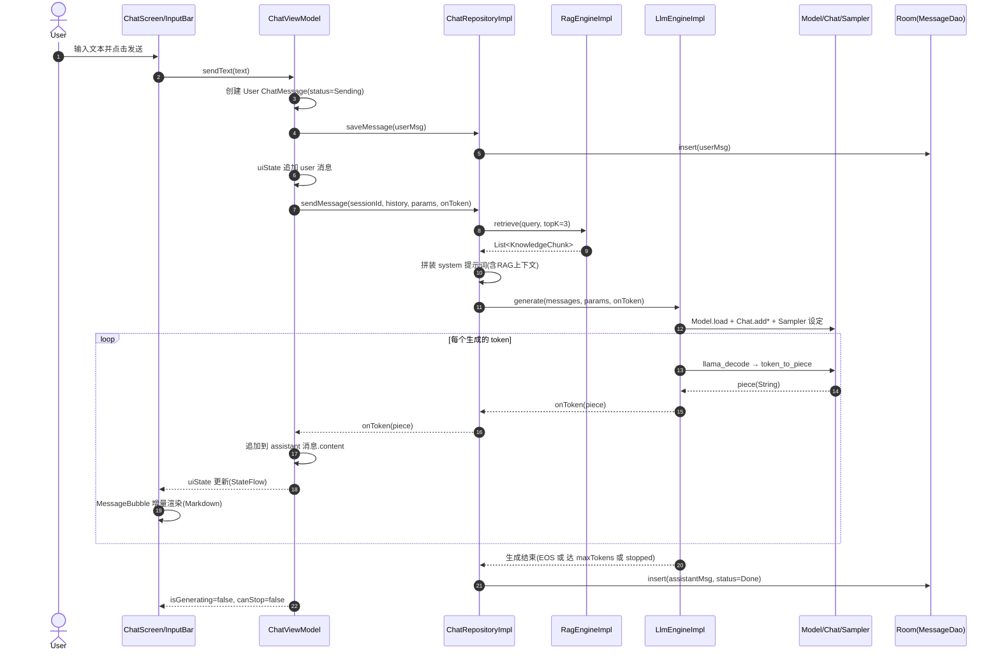
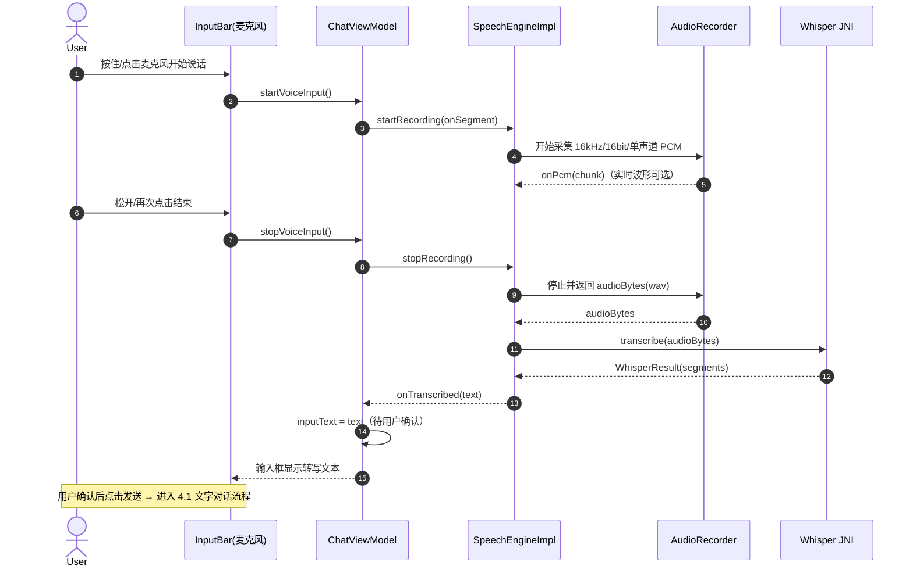
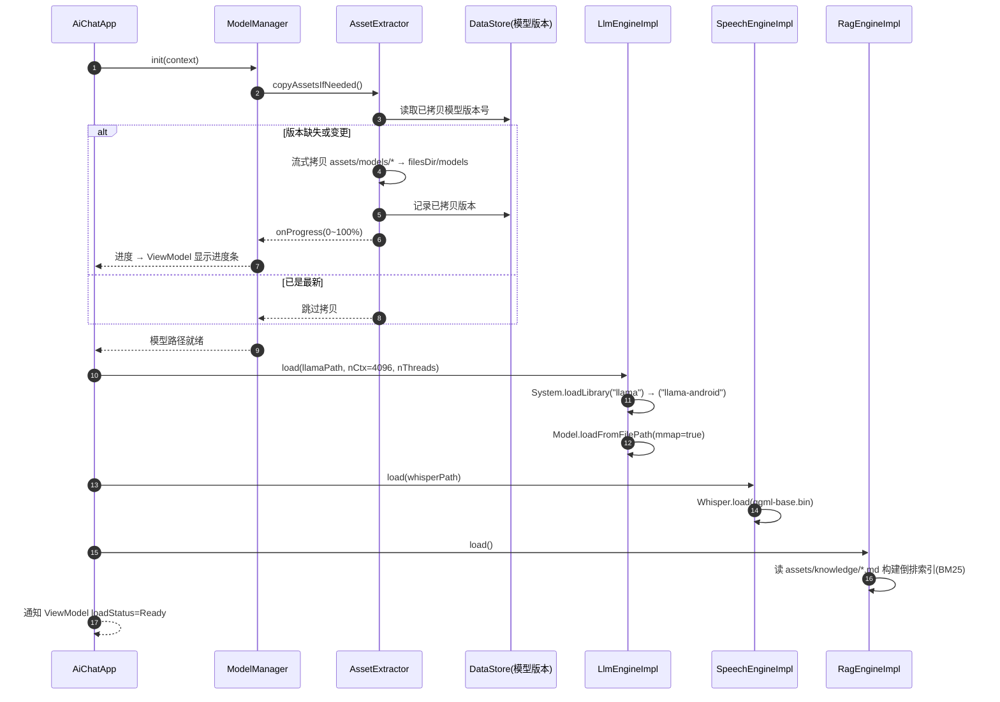

# 安卓端侧 AI 对话系统 — 系统架构设计 + 任务分解

> **文档版本**：v1.0
> **作者**：高见远（架构师 / software-architect）
> **日期**：2026-07-08
> **配套输入**：PRD（产品经理 Alice）+ 主理人锁定的技术约束
> **交付根目录**：`C:\Users\ASUS\Desktop\AI 对话系统\android-app\`

---

## 0. 设计总览（一页纸）

| 维度 | 决策 |
|------|------|
| 语言/UI | Kotlin + Jetpack Compose（Material 3），minSdk 24，targetSdk 34 |
| 端侧 LLM | Phi-3-mini GGUF，经 **llama.cpp Android JNI**（`libllama.so` + `libllama-android.so`）mmap 推理，流式 token 回调 |
| 端侧语音转写 | **whisper.cpp Android JNI**（`libwhisper.so`，`ggml-base.bin`）16kHz PCM 转写 |
| 本地知识库 | **RAG-lite**：`assets/knowledge/*.md` 启动时读入内存，构建倒排索引 + BM25 取 top-k，**不引入任何 embedding 模型** |
| 持久化 | Room（会话表 + 消息表），重启恢复 |
| 构建 | Android Gradle（Kotlin DSL）+ CMake + NDK → 可安装 APK |
| 权限 | `RECORD_AUDIO`；默认 **不申请** `INTERNET`（完全离线），保留一个可关闭的开关位 |
| 架构模式 | MVVM + Repository + 端侧引擎层（JNI 封装隔离） |
| 依赖注入 | 轻量手动 DI 容器 `AppModule`（零注解处理器风险，见第 7 节） |

> ⚠️ **与原 Python 原型的差异（务必知悉）**：参考原型 `AI 对话系统/`（父目录）使用 FAISS + M3E embedding（1536 维）做向量检索。本安卓版按主理人约束**改为内存 BM25 稀疏检索（RAG-lite）**，不再依赖 FAISS / 任何 embedding 模型 / 外置 SQLite，全部知识在内存完成。类 `RagEngineImpl` 即对应此改型。

---

## 1. 实现方案与框架选型

### 1.1 核心难点

1. **原生推理接入**：在 Android 上跑 llama.cpp / whisper.cpp 必须走 JNI，需要处理 C++ 编译（NDK/CMake）、`System.loadLibrary` 顺序、`jobject` 引用管理、流式回调线程安全。
2. **APK 体积爆炸**：Phi-3-mini Q4 ~1.2GB + `ggml-base.bin` ~150MB，若直接打进 assets，APK 将超 1.5GB，无法常规分发与 CI。
3. **首启拷贝耗时**：1.2GB+ 模型从 assets 拷贝到 `getFilesDir()/models` 耗时数十秒到数分钟，且需避免重复拷贝。
4. **内存与推理性能**：Phi-3 上下文 128K 在手机端不可行（KV cache 爆内存）；需限制 `n_ctx`、合理设置线程数。
5. **流式 UI 一致性**：token 一边生成一边渲染，需保证后台线程产出、主线程只做渲染，且支持「停止生成」。

### 1.2 框架 / 库选型与理由

| 类别 | 选型 | 理由 |
|------|------|------|
| UI 框架 | Jetpack Compose + Material 3 | 声明式、离线友好、与 Kotlin 一等公民集成；Material 3 提供深色模式、动态色 |
| 状态管理 | `ViewModel` + `StateFlow` + `collectAsStateWithLifecycle` | 生命周期安全、可测试、天然适配流式更新 |
| 端侧 LLM | llama.cpp Android JNI（官方 `example/llama.android`） | 成熟、mmap、支持 `llama_decode` + `token_to_piece` 流式；Phi-3 GGUF 原生支持 |
| 端侧 ASR | whisper.cpp Android JNI（官方 `example/whisper.android`） | 轻量、离线、`ggml-base.bin` 中文效果可用 |
| 本地检索 | 自研内存倒排索引 + BM25（RAG-lite） | 零额外模型/依赖，满足约束；知识量小（数 MB 文本）完全够用 |
| 持久化 | Room（KSP 注解） | 编译期 SQL 校验、协程支持、重启恢复会话/消息 |
| 导航 | Navigation Compose | 主聊天 ↔ 设置两页切换 |
| Markdown 渲染 | `com.github.jeziellago:compose-markdown`（MarkdownText） | Compose 原生、轻量、无 WebView |
| 键值存储 | DataStore (`androidx.datastore:datastore-preferences`) | 存设置项、模型已拷贝版本号（避免重复拷贝） |
| 协程/并发 | kotlinx-coroutines | 推理/拷贝/DB 全异步 |
| 系统栏适配 | `androidx.activity:activity-compose` 的 `enableEdgeToEdge()` | 沉浸式状态栏，深色模式统一 |

### 1.3 架构分层

```
┌─────────────────────────────────────────────┐
│ UI 层 (Compose)                              │  ChatScreen / SettingsScreen / 组件
│  - 仅消费 StateFlow，发 Intent 给 ViewModel   │
├─────────────────────────────────────────────┤
│ ViewModel 层                                 │  ChatViewModel / SettingsViewModel
│  - 状态聚合、流式 token 拼装、停止控制         │
├─────────────────────────────────────────────┤
│ Repository 层 (领域编排)                      │  ChatRepositoryImpl
│  - 串联 RAG → 提示词 → LLM → 落库            │
├─────────────────────────────────────────────┤
│ 端侧引擎层 (接口 + 实现，JNI 隔离)            │  LlmEngine / SpeechEngine / RagEngine
├─────────────────────────────────────────────┤
│ JNI 封装层 (Kotlin ↔ C++)                    │  Llama/Model/Chat/Sampler/Token/Whisper…
├─────────────────────────────────────────────┤
│ 原生层 (NDK/CMake, git submodule)            │  libllama.so / libllama-android.so / libwhisper.so
├─────────────────────────────────────────────┤
│ 数据与模型层                                  │  Room / DataStore / ModelManager / AssetExtractor
└─────────────────────────────────────────────┘
```

### 1.4 关键风险与对策

| 风险 | 影响 | 对策 |
|------|------|------|
| **APK 体积超 1.5GB** | 无法安装/分发/CI 超时 | ① 默认 **不把模型打进 release APK**；`assets/models/` 仅放占位 `README` + 下载脚本；首启用「可选联网开关」从 CDN/HF 拉取并落地 `filesDir/models`（默认开关关闭，完全离线时由用户手动放置）。② 若必须内置，使用 `aaptOptions { noCompress "gguf","bin" }` 避免二次压缩，并出 App Bundle（.aab）按 ABI 拆分。③ NDK `extractNativeLibs` 视情况设置。 |
| **首启拷贝耗时（1GB+）** | 黑屏/ANR、用户流失 | ① `AssetExtractor` 用 `AssetManager.open()` **流式拷贝**并回报进度；② 用 DataStore 记录「已拷贝模型版本号」，仅版本变更才拷贝；③ 拷贝与模型加载在 `Dispatchers.IO` 后台进行，UI 显示进度条 + 「正在准备模型」。 |
| **内存不足（KV cache / mmap）** | OOM、推理崩溃 | ① `n_ctx` 默认 **4096**（设置可调，上限 8192），**不要**用原型的 32768；② `mmap=true` 减少常驻；③ `n_threads = min(Runtime.availableProcessors(), 4)`；④ 推荐设备 ≥4GB RAM，文档标注最低/推荐配置。 |
| **推理卡顿/发热** | 体验差 | ① 单线程调度器 `Dispatchers.Default.limitedParallelism(1)` 串行化 LLM 调用，避免并发访问同一模型；② 流式 token 仅追加渲染；③ 提供「停止生成」（`llama_decode` 提前结束）。 |
| **JNI 引用泄漏/崩溃** | native crash | ① `System.loadLibrary` 顺序固定（见 7.4）；② C++ 侧对 `jstring/jbyteArray` 及时 `DeleteLocalRef`；③ Kotlin 侧用 `@Keep` 保活 native 方法类，ProGuard 不混淆 JNI 类名/方法名（见 proguard-rules）。 |
| **whisper 中文词错** | 转写不准 | ① 固定 16kHz / 16bit / 单声道 PCM；② 提供「按住说话 / 点击开关」两种范式（P1）；③ 转写结果回填输入框由用户确认后再发送，降低误发。 |

---

## 2. 文件列表（相对 `android-app/` 根）

> 包名统一：`com.aichat.app`。Kotlin 源置于 `app/src/main/kotlin/com/aichat/app/`，原生置于 `app/src/main/cpp/`。

### 2.1 目录树

```
android-app/
├── settings.gradle.kts
├── build.gradle.kts                         # 根：plugins + 仓库
├── gradle.properties
├── local.properties.template                # 提交模板（真实文件 gitignore）
├── .gitignore
├── .gitmodules                              # llama.cpp / whisper.cpp submodule
├── README.md
├── .github/
│   └── workflows/
│       └── build.yml                        # CI：JDK+NDK+CMake 编译 APK
└── app/
    ├── build.gradle.kts
    ├── proguard-rules.pro
    └── src/
        ├── main/
        │   ├── AndroidManifest.xml
        │   ├── cpp/
        │   │   ├── CMakeLists.txt
        │   │   ├── llama-android-jni.cpp     # llama.android 的 JNI 绑定
        │   │   ├── whisper-android-jni.cpp   # whisper.android 的 JNI 绑定
        │   │   └── third-party/              # git submodule 根
        │   │       ├── llama.cpp/            # (submodule) 官方仓库
        │   │       └── whisper.cpp/          # (submodule) 官方仓库
        │   ├── kotlin/com/aichat/app/
        │   │   ├── AiChatApp.kt              # Application
        │   │   ├── MainActivity.kt           # 入口 Activity（setContent）
        │   │   ├── di/AppModule.kt           # 手动 DI 容器
        │   │   ├── config/
        │   │   │   ├── Constants.kt          # 全局常量
        │   │   │   ├── ModelPaths.kt         # 模型路径/文件名常量
        │   │   │   └── AppConfig.kt          # 默认参数 & 特性开关
        │   │   ├── domain/
        │   │   │   ├── model/
        │   │   │   │   ├── ChatMessage.kt
        │   │   │   │   ├── Session.kt
        │   │   │   │   ├── Role.kt
        │   │   │   │   ├── LlmParams.kt
        │   │   │   │   ├── GenerationState.kt
        │   │   │   │   └── KnowledgeChunk.kt
        │   │   │   └── Result.kt             # 统一结果/错误封装
        │   │   ├── data/
        │   │   │   ├── local/room/
        │   │   │   │   ├── ChatDatabase.kt
        │   │   │   │   ├── SessionDao.kt
        │   │   │   │   ├── MessageDao.kt
        │   │   │   │   ├── SessionEntity.kt
        │   │   │   │   └── MessageEntity.kt
        │   │   │   └── repository/
        │   │   │       ├── ChatRepository.kt        # 接口
        │   │   │       ├── ChatRepositoryImpl.kt    # 实现（编排）
        │   │   │       └── SettingsRepository.kt    # 接口+实现（设置/开关）
        │   │   ├── engine/
        │   │   │   ├── model/
        │   │   │   │   ├── AssetExtractor.kt        # assets→filesDir 流式拷贝
        │   │   │   │   └── ModelManager.kt          # 模型就绪编排/版本号
        │   │   │   ├── llm/
        │   │   │   │   ├── LlmEngine.kt             # 接口
        │   │   │   │   └── LlmEngineImpl.kt         # 封装 llama JNI
        │   │   │   ├── speech/
        │   │   │   │   ├── SpeechEngine.kt          # 接口
        │   │   │   │   ├── SpeechEngineImpl.kt      # 封装 whisper JNI
        │   │   │   │   └── AudioRecorder.kt         # 麦克风采集 16k PCM
        │   │   │   └── rag/
        │   │   │       ├── RagEngine.kt             # 接口
        │   │   │       ├── RagEngineImpl.kt         # BM25 检索
        │   │   │       └── InvertedIndex.kt         # 倒排索引+BM25
        │   │   ├── jni/
        │   │   │   ├── llama/
        │   │   │   │   ├── Llama.kt
        │   │   │   │   ├── Model.kt
        │   │   │   │   ├── Chat.kt
        │   │   │   │   ├── Sampler.kt
        │   │   │   │   └── Token.kt
        │   │   │   └── whisper/
        │   │   │       ├── Whisper.kt
        │   │   │       ├── WhisperResult.kt
        │   │   │       └── WhisperSegment.kt
        │   │   └── ui/
        │   │       ├── theme/{Theme.kt, Color.kt, Type.kt}
        │   │       ├── viewmodel/{ChatViewModel.kt, SettingsViewModel.kt, UiState.kt}
        │   │       ├── component/{MessageList.kt, MessageBubble.kt, InputBar.kt, TopBar.kt, LoadingIndicator.kt, ErrorSnackbar.kt}
        │   │       ├── ChatScreen.kt
        │   │       ├── SettingsScreen.kt
        │   │       └── AppNavHost.kt
        │   ├── assets/
        │   │   ├── models/
        │   │   │   ├── README.md              # 模型获取/放置说明（默认不内置）
        │   │   │   └── .gitkeep
        │   │   └── knowledge/
        │   │       ├── doc1_多节点对讲系统.md
        │   │       ├── doc2_手机端本地部署.md
        │   │       ├── doc3_AI语音对话系统.md
        │   │       └── doc4_Phi-3模型介绍.md
        │   └── res/
        │       ├── values/{strings.xml, themes.xml}
        │       ├── xml/{backup_rules.xml, data_extraction_rules.xml}
        │       └── mipmap-*/ic_launcher_*     # 启动图标（工程师补二进制）
        └── test/  (可选单测桩：RagEngineImplTest / InvertedIndexTest)
```

### 2.2 关键文件职责表

| 文件 | 职责 |
|------|------|
| `app/build.gradle.kts` | 声明 namespace、minSdk/targetSdk、依赖（Compose BOM/Material3/Room/Nav/Coroutines/Markdown/DataStore）、`externalNativeBuild { cmake }`、NDK、abiFilters、aaptOptions noCompress |
| `app/src/main/cpp/CMakeLists.txt` | `add_subdirectory(third-party/llama.cpp)`、`add_subdirectory(third-party/whisper.cpp)`；编译 `llama-android-jni.cpp`/`whisper-android-jni.cpp` 为 `libllama-android.so`/`libwhisper.so`；链接 `llama`/`whisper`/`ggml` |
| `AiChatApp.kt` | 继承 `Application`，`onCreate` 中构建 `AppModule`（单例图），持有 `ModelManager` 预热 |
| `MainActivity.kt` | `ComponentActivity`，`enableEdgeToEdge()` + `setContent { AppNavHost() }`，请求 `RECORD_AUDIO` 权限 |
| `di/AppModule.kt` | 手动装配：Room DB、DAO、各 Engine 实现、`ChatRepositoryImpl`、`SettingsRepository`、`ChatViewModel`/`SettingsViewModel` 工厂；单例作用域 |
| `config/ModelPaths.kt` | `LLAMA_MODEL_FILE`、`WHISPER_MODEL_FILE`、`ASSETS_MODELS_DIR`、`ASSETS_KNOWLEDGE_DIR`、`KNOWLEDGE_GLOB` 等常量 |
| `engine/model/AssetExtractor.kt` | `copyAssetFile(name, dest, onProgress)` 流式拷贝；`isCopied(name)` 依据 DataStore 版本号判断 |
| `engine/model/ModelManager.kt` | 编排「拷贝→返回路径」；`getLlamaPath()`/`getWhisperPath()`；首启进度事件 |
| `engine/llm/LlmEngineImpl.kt` | 调 `Model.loadFromFilePath(mmap)`、`Chat` 管理对话、`Sampler` 采样、`llama_decode` 循环 + `token_to_piece` 流式回调 `onToken`；`stop()` |
| `engine/speech/SpeechEngineImpl.kt` | 调 `Whisper.load` + `decode(audioBytes)` → `WhisperResult`；`AudioRecorder` 采集/停止 |
| `engine/rag/RagEngineImpl.kt` + `InvertedIndex.kt` | 启动时读 `assets/knowledge` 建倒排索引；`retrieve(query, topK)` 返回 BM25 排序 `KnowledgeChunk` |
| `data/repository/ChatRepositoryImpl.kt` | 核心编排：`retrieve→拼系统提示词→LlmEngine.generate(onToken)→逐 token 落库`；`transcribe(audio)`；会话/消息 CRUD |
| `data/local/room/*` | `SessionEntity`/`MessageEntity` + DAO（`insertMessage`、`getMessagesBySession`、`createSession`、`getSessions`）；`ChatDatabase` |
| `ui/viewmodel/ChatViewModel.kt` | 暴露 `uiState: StateFlow<ChatUiState>`；`sendText`/`startVoiceInput`/`stopVoiceInput`/`stopGeneration`/`loadHistory`；流式拼装 assistant 消息 |
| `ui/ChatScreen.kt` + `component/*` | 顶栏 + `MessageList`(`MessageBubble` 渲染 Markdown) + `InputBar`(麦克风/输入框/发送) + `LoadingIndicator` + `ErrorSnackbar` |
| `ui/SettingsScreen.kt` | 温度/最大 token/模型名/深色模式/联网兜底开关 |
| `AndroidManifest.xml` | `RECORD_AUDIO` 权限、`INTERNET` 默认不声明（开关开启时由 `SettingsRepository` 动态提示）；`android:extractNativeLibs`；`AiChatApp` 注册 |

---

## 3. 数据结构和接口（类图）

```mermaid
classDiagram
    %% ============ UI / ViewModel ============
    class ChatUiState {
        +List~ChatMessage~ messages
        +Boolean isGenerating
        +Boolean canStop
        +String inputText
        +LoadStatus loadStatus
        +AppError? error
    }
    class Settings {
        +Float temperature
        +Int maxTokens
        +String modelName
        +Boolean darkMode
        +Boolean networkFallback
    }
    class ChatViewModel {
        -StateFlow~ChatUiState~ _uiState
        -StateFlow~Settings~ _settings
        +StateFlow~ChatUiState~ uiState
        +sendText(text: String)
        +startVoiceInput()
        +stopVoiceInput()
        +stopGeneration()
        +loadHistory()
        +onInputChanged(text: String)
    }
    class SettingsViewModel {
        +updateTemperature(v: Float)
        +updateMaxTokens(v: Int)
        +toggleDarkMode()
        +toggleNetworkFallback()
    }

    %% ============ 领域模型 ============
    class ChatMessage {
        +String id
        +String sessionId
        +Role role
        +String content
        +Long createdAt
        +MessageStatus status
    }
    class Role {
        <<enum>>
        System
        User
        Assistant
    }
    class Session {
        +String id
        +String title
        +Long updatedAt
    }
    class LlmParams {
        +Float temperature
        +Float topP
        +Int maxTokens
        +Int nCtx
        +Int nThreads
        +List~String~ stop
    }
    class GenerationState {
        <<enum>>
        Idle
        Generating
        Stopped
        Error
    }
    class KnowledgeChunk {
        +String id
        +String text
        +Float score
    }
    class AppError {
        <<sealed>>
        +ModelLoadFailed(msg)
        +AssetCopyFailed(msg)
        +InferenceFailed(msg)
        +TranscriptionFailed(msg)
        +RagLoadFailed(msg)
    }

    %% ============ Repository ============
    class ChatRepository {
        <<interface>>
        +sendMessage(sessionId, history, params, onToken)
        +transcribe(audio: ByteArray): String
        +retrieve(query, topK): List~KnowledgeChunk~
        +saveMessage(msg: ChatMessage)
        +getMessages(sessionId): List~ChatMessage~
        +getSessions(): List~Session~
    }
    class ChatRepositoryImpl {
        -LlmEngine llm
        -SpeechEngine speech
        -RagEngine rag
        -SessionDao sessionDao
        -MessageDao messageDao
        +sendMessage(...)
        +transcribe(audio): String
        +retrieve(query, topK)
        +saveMessage(msg)
    }
    class SettingsRepository {
        <<interface>>
        +getSettings(): Flow~Settings~
        +setTemperature(v)
        +setNetworkFallback(b)
    }

    %% ============ 端侧引擎接口 ============
    class LlmEngine {
        <<interface>>
        +load(path: String, params: LlmParams)
        +generate(messages: List~ChatMessage~, params: LlmParams, onToken: (String)->Unit)
        +stop()
        +unload()
    }
    class SpeechEngine {
        <<interface>>
        +load(path: String)
        +startRecording(onSegment: (String)->Unit)
        +stopRecording(): ByteArray
        +transcribe(audio: ByteArray): String
    }
    class RagEngine {
        <<interface>>
        +load()
        +retrieve(query: String, topK: Int): List~KnowledgeChunk~
    }

    %% ============ 引擎实现 ============
    class LlmEngineImpl {
        -Model model
        -Chat chat
        -Sampler sampler
        -Boolean stopped
        +load(path, params)
        +generate(messages, params, onToken)
        +stop()
    }
    class SpeechEngineImpl {
        -Whisper whisper
        -AudioRecorder recorder
        +load(path)
        +startRecording(onSegment)
        +stopRecording(): ByteArray
        +transcribe(audio): String
    }
    class AudioRecorder {
        +start(onPcm: (ByteArray)->Unit)
        +stop(): ByteArray
        +isRecording: Boolean
    }
    class RagEngineImpl {
        -InvertedIndex index
        +load()
        +retrieve(query, topK): List~KnowledgeChunk~
    }
    class InvertedIndex {
        -Map~String, List~Posting~~ postings
        -Map~String, String~ docs
        +build(docs: Map~String,String~)
        +search(query: String, topK: Int): List~KnowledgeChunk~
        -bm25(tf, df, N, dl, avgdl): Float
    }

    %% ============ 模型管理 ============
    class ModelManager {
        -AssetExtractor extractor
        +init(context)
        +getLlamaPath(): String
        +getWhisperPath(): String
        +copyIfNeeded(onProgress: (Int)->Unit)
    }
    class AssetExtractor {
        +copyAssetFile(name, dest, onProgress)
        +isCopied(name): Boolean
    }

    %% ============ Room ============
    class ChatDatabase {
        <<RoomDatabase>>
        +sessionDao(): SessionDao
        +messageDao(): MessageDao
    }
    class SessionDao {
        <<interface>>
        +insert(session: SessionEntity)
        +getSessions(): List~SessionEntity~
    }
    class MessageDao {
        <<interface>>
        +insert(msg: MessageEntity)
        +getBySession(sessionId): List~MessageEntity~
    }
    class SessionEntity {
        +String id
        +String title
        +Long updatedAt
    }
    class MessageEntity {
        +String id
        +String sessionId
        +Int role
        +String content
        +Long createdAt
        +Int status
    }

    %% ============ JNI 封装 ============
    class Llama {
        <<JNI wrapper>>
        +loadLibrary()
        +createContext(model, params): Long
    }
    class Model {
        +loadFromFilePath(path: String, mmap: Boolean): Model
        +nCtx(): Int
    }
    class Chat {
        +addSystem(msg: String)
        +addUser(msg: String)
        +addAssistant(msg: String)
        +reset()
    }
    class Sampler {
        +temperature(v: Float)
        +topP(v: Float)
        +maxTokens(v: Int)
    }
    class Token {
        +toPiece(model: Model, tokenId: Int): String
    }
    class Whisper {
        +load(path: String): Whisper
        +decode(audio: ByteArray): WhisperResult
    }
    class WhisperResult {
        +List~WhisperSegment~ segments
        +text(): String
    }
    class WhisperSegment {
        +Int tid
        +String text
        +Float tStart
        +Float tEnd
    }

    %% ============ 装配 ============
    class AppModule {
        +chatRepository: ChatRepository
        +settingsRepository: SettingsRepository
        +chatViewModel(): ChatViewModel
        +settingsViewModel(): SettingsViewModel
    }
    class AiChatApp {
        +appModule: AppModule
    }
    class MainActivity {
        +onCreate()
    }

    %% ===== 关系 =====
    ChatViewModel ..> ChatRepository : uses
    ChatViewModel ..> SettingsRepository : reads
    SettingsViewModel ..> SettingsRepository : updates
    ChatViewModel ..> ChatUiState : exposes
    ChatViewModel ..> Settings : observes
    ChatRepository <|.. ChatRepositoryImpl
    ChatRepositoryImpl ..> LlmEngine
    ChatRepositoryImpl ..> SpeechEngine
    ChatRepositoryImpl ..> RagEngine
    ChatRepositoryImpl ..> SessionDao
    ChatRepositoryImpl ..> MessageDao
    ChatRepositoryImpl ..> ChatMessage
    LlmEngine <|.. LlmEngineImpl
    SpeechEngine <|.. SpeechEngineImpl
    RagEngine <|.. RagEngineImpl
    LlmEngineImpl ..> Model
    LlmEngineImpl ..> Chat
    LlmEngineImpl ..> Sampler
    LlmEngineImpl ..> Token
    LlmEngineImpl ..> Llama
    SpeechEngineImpl ..> Whisper
    SpeechEngineImpl ..> WhisperResult
    SpeechEngineImpl ..> WhisperSegment
    SpeechEngineImpl ..> AudioRecorder
    RagEngineImpl ..> InvertedIndex
    RagEngineImpl ..> KnowledgeChunk
    ModelManager ..> AssetExtractor
    ChatRepositoryImpl ..> ModelManager : via engine load
    ChatDatabase *-- SessionDao
    ChatDatabase *-- MessageDao
    SessionDao ..> SessionEntity
    MessageDao ..> MessageEntity
    AppModule ..> ChatRepositoryImpl
    AppModule ..> ChatViewModel
    AppModule ..> SettingsViewModel
    AppModule ..> LlmEngineImpl
    AppModule ..> SpeechEngineImpl
    AppModule ..> RagEngineImpl
    AiChatApp ..> AppModule : builds
    MainActivity ..> ChatViewModel : obtains
```



---

## 4. 程序调用流程（时序图）

> 以下三图亦单独存于 `docs/sequence-diagram.mermaid`。

### 4.1 一次文字对话（流式）



### 4.2 一次语音输入（转写回填）



### 4.3 启动加载（assets→内部存储→mmap 加载→就绪）



---

## 5. 任务列表（有序、依赖、验收）

> 共 **5 个任务**（满足「≤5 任务、首个必为基础设施、每任务≥3 文件」约束）。顺序即工程师「批量写完全部文件」的顺序。任务间为线性依赖链 `T01→T02→T03→T04→T05`，每层只依赖前一层（接口契约已在被依赖层定义）。

### T01 — 项目基础设施与构建配置（P0）

- **目标**：搭好可编译骨架：Gradle/CMake/Manifest/CI/README，Application 与 MainActivity 空壳。
- **产出文件**：`settings.gradle.kts`、`build.gradle.kts`、`gradle.properties`、`local.properties.template`、`.gitignore`、`.gitmodules`、`app/build.gradle.kts`、`app/proguard-rules.pro`、`app/src/main/AndroidManifest.xml`、`app/src/main/cpp/CMakeLists.txt`、`.github/workflows/build.yml`、`README.md`、`app/src/main/kotlin/com/aichat/app/AiChatApp.kt`（空壳）、`app/src/main/kotlin/com/aichat/app/MainActivity.kt`（空壳 `setContent{}`）。
- **依赖**：无（起始任务）。
- **验收点**：`./gradlew :app:assembleDebug` 能编译出最小空壳 APK（尚未含 native 逻辑，先 `externalNativeBuild` 占位或临时空 `CMakeLists` 也可）；Manifest 含 `RECORD_AUDIO` 且**未**声明 `INTERNET`；CI 能触发。

### T02 — 端侧引擎层（JNI 封装 + 模型加载 + LLM/语音/RAG 引擎 + 领域模型/接口）（P0）

- **目标**：实现全部原生桥接与三大端侧能力（LLM 流式、语音转写、RAG-lite），并定义领域模型与引擎接口契约。
- **产出文件**：
  - 原生：`app/src/main/cpp/llama-android-jni.cpp`、`app/src/main/cpp/whisper-android-jni.cpp`
  - JNI 封装：`jni/llama/{Llama,Model,Chat,Sampler,Token}.kt`、`jni/whisper/{Whisper,WhisperResult,WhisperSegment}.kt`
  - 模型管理：`engine/model/{AssetExtractor,ModelManager}.kt`
  - 引擎：`engine/llm/{LlmEngine,LlmEngineImpl}.kt`、`engine/speech/{SpeechEngine,SpeechEngineImpl,AudioRecorder}.kt`、`engine/rag/{RagEngine,RagEngineImpl,InvertedIndex}.kt`
  - 领域模型与契约：`domain/model/{ChatMessage,Session,Role,LlmParams,GenerationState,KnowledgeChunk}.kt`、`domain/Result.kt`、`config/{Constants,ModelPaths,AppConfig}.kt`
- **依赖**：T01。
- **验收点**：`LlmEngineImpl.generate` 能在单测/样例中对一段 `messages` 产出流式 `onToken` 回调；`RagEngineImpl.retrieve("多节点 AI 对讲系统")` 能从 `assets/knowledge` 返回 top-3 并按 BM25 排序；`AssetExtractor` 能把 assets 文件流式拷贝到 `filesDir` 且进度可观测；ProGuard 保留 JNI 类名/方法名。

### T03 — 数据持久化与仓库层（Room + Repository 实现）（P0）

- **目标**：落地会话/消息持久化与统一编排（RAG→提示词→LLM→落库），打通端到端对话与语音转写入口。
- **产出文件**：`data/local/room/{ChatDatabase,SessionDao,MessageDao,SessionEntity,MessageEntity}.kt`、`data/repository/{ChatRepository,ChatRepositoryImpl,SettingsRepository}.kt`、`app/src/main/assets/knowledge/{doc1_多节点对讲系统.md, doc2_手机端本地部署.md, doc3_AI语音对话系统.md, doc4_Phi-3模型介绍.md}`、`app/src/main/assets/models/README.md`（+`.gitkeep`）。
- **依赖**：T02（使用引擎接口与领域模型）。
- **验收点**：`ChatRepositoryImpl.sendMessage` 端到端跑通（检索→生成→逐 token 落库→重查可见）；重启 App 后 `getSessions()/getMessages()` 能恢复历史；`SettingsRepository` 能经 DataStore 持久化温度/深色模式/联网开关。

### T04 — 表现层（Compose UI + ViewModel + 主题/导航/资源）（P0/P1）

- **目标**：完整可交互界面：聊天主页（顶栏+消息列表+Markdown 气泡+输入栏含麦克风/发送+推理中/停止）、设置页、深色模式、导航。
- **产出文件**：`ui/theme/{Theme,Color,Type}.kt`、`ui/viewmodel/{ChatViewModel,SettingsViewModel,UiState}.kt`、`ui/ChatScreen.kt`、`ui/SettingsScreen.kt`、`ui/AppNavHost.kt`、`ui/component/{MessageList,MessageBubble,InputBar,TopBar,LoadingIndicator,ErrorSnackbar}.kt`、`app/src/main/res/values/{strings.xml,themes.xml}`、`app/src/main/res/xml/{backup_rules.xml,data_extraction_rules.xml}`。
- **依赖**：T02、T03（依赖引擎接口、Repository 接口、领域模型）。
- **验收点**：`ChatViewModel.sendText` 触发后消息列表实时流式渲染 Markdown；「停止生成」可中断；麦克风按住/点击两种范式均能回填输入框；深色模式切换生效；设置页改动回写 `SettingsRepository` 并被 `ChatViewModel` 读取。

### T05 — 集成联调与交付（DI 装配 + 错误处理 + 联网兜底位 + 构建验证）（P0/P1/P2）

- **目标**：用 `AppModule` 把全部实现注入 ViewModel，补统一错误处理与可选联网兜底开关位，完成 `AiChatApp`/`MainActivity` 完整装配，产出可发布说明。
- **产出文件**：`di/AppModule.kt`、`domain/Result.kt` 配套使用说明、`ui/component/ErrorSnackbar.kt`（消费 `AppError`）、`AiChatApp.kt`（完整装配 `AppModule` + 预热 `ModelManager`）、`MainActivity.kt`（权限请求 + `enableEdgeToEdge` + `setContent{AppNavHost()}`）、`README.md`（安装/获取模型/构建/CI/已知限制）、`docs/` 设计文档归档。
- **依赖**：T01–T04。
- **验收点**：`assembleRelease` 产出可安装 APK；完全离线启动→首启拷贝→推理→语音→RAG→落库→重启恢复全链路通过；开启「联网兜底」开关时 Manifest/代码路径预留 `INTERNET` 申请位（默认关闭）；`ErrorSnackbar` 能在模型缺失/拷贝失败/推理异常时给出可读提示。

---

## 6. 依赖包列表

### 6.1 `app/build.gradle.kts` 关键 dependencies

```kotlin
// ── Kotlin / Coroutines ──
implementation("org.jetbrains.kotlinx:kotlinx-coroutines-android:1.8.0")
implementation("org.jetbrains.kotlinx:kotlinx-coroutines-core:1.8.0")

// ── AndroidX 基础 ──
implementation("androidx.core:core-ktx:1.13.1")
implementation("androidx.lifecycle:lifecycle-runtime-ktx:2.7.0")
implementation("androidx.lifecycle:lifecycle-viewmodel-compose:2.7.0")
implementation("androidx.lifecycle:lifecycle-runtime-compose:2.7.0")
implementation("androidx.activity:activity-compose:1.9.0")   // enableEdgeToEdge()
implementation("androidx.datastore:datastore-preferences:1.1.1")

// ── Compose BOM（统一版本）──
implementation(platform("androidx.compose:compose-bom:2024.06.00"))
implementation("androidx.compose.ui:ui")
implementation("androidx.compose.ui:ui-graphics")
implementation("androidx.compose.ui:ui-tooling-preview")
implementation("androidx.compose.material3:material3")
implementation("androidx.compose.material:material-icons-extended")
debugImplementation("androidx.compose.ui:ui-tooling")

// ── Navigation Compose ──
implementation("androidx.navigation:navigation-compose:2.7.7")

// ── Room（KSP）──
implementation("androidx.room:room-runtime:2.6.1")
implementation("androidx.room:room-ktx:2.6.1")
ksp("androidx.room:room-compiler:2.6.1")

// ── Markdown 渲染（Compose）──
implementation("com.github.jeziellago:compose-markdown:0.5.0")

// ── 系统栏颜色（可选，亦可只用 enableEdgeToEdge）──
implementation("com.google.accompanist:accompanist-systemuicontroller:0.34.0")

// ── 测试 ──
testImplementation("junit:junit:4.13.2")
testImplementation("org.jetbrains.kotlinx:kotlinx-coroutines-test:1.8.0")
androidTestImplementation(platform("androidx.compose:compose-bom:2024.06.00"))
androidTestImplementation("androidx.compose.ui:ui-test-junit4")
```

根 `build.gradle.kts` 需引入：
```kotlin
plugins {
    id("com.android.application") version "8.3.2" apply false
    id("org.jetbrains.kotlin.android") version "1.9.24" apply false
    id("com.google.devtools.ksp") version "1.9.24-1.0.20" apply false
}
```
`app/build.gradle.kts` 顶部：
```kotlin
plugins { id("com.android.application"); id("org.jetbrains.kotlin.android"); id("com.google.devtools.ksp") }
android {
    namespace = "com.aichat.app"
    compileSdk = 34
    defaultConfig { minSdk = 24; targetSdk = 34;
        ndk { abiFilters += listOf("arm64-v8a","armeabi-v7a") }
        externalNativeBuild { cmake { arguments += "-DANDROID_STL=c++_shared" } }
    }
    buildFeatures { compose = true; buildConfig = true }
    composeOptions { kotlinCompilerExtensionVersion = "1.5.14" }
    externalNativeBuild { cmake { path = file("src/main/cpp/CMakeLists.txt"); version = "3.22.1" } }
    packaging { jniLibs { useLegacyPackaging = false } }
    aaptOptions { noCompress += listOf("gguf","bin") }   // 避免模型二次压缩
    buildTypes { release { isMinifyEnabled = true; proguardFiles(...) } }
}
```

### 6.2 原生 / submodule 版本

| 项 | 版本/来源 | 说明 |
|----|-----------|------|
| `app/src/main/cpp/third-party/llama.cpp` | git submodule，pin 到 **近期稳定 commit**（如 `b3xxx`，建议 ≥ 2024-05） | 官方 `example/llama.android` 提供 `Llama/Model/Chat/Sampler/Token` JNI 封装与 `libllama.so` |
| `app/src/main/cpp/third-party/whisper.cpp` | git submodule，pin 到 **与 llama.cpp 同期 ggml 兼容 commit** | 官方 `example/whisper.android` 提供 `libwhisper.so` + `Whisper/WhisperResult/WhisperSegment` |
| NDK | `26.1.10909125`（或 25.2.9519653） | 经 `local.properties` / CI `ndkVersion` 指定 |
| CMake | `3.22.1` | `externalNativeBuild` 指定 |
| Phi-3-mini GGUF | `Phi-3-mini-4K-Instruct-Q4_K_M.gguf`（推荐）或 `...-128K-Instruct-Q4_K_M.gguf` | 见第 8 节待明确 |
| whisper 模型 | `ggml-base.bin`（~150MB） | 经 submodule 的 `models/` 下载脚本获取，或放 `assets/models/` |

> **submodule 约定**：`.gitmodules` 中两条 `path = app/src/main/cpp/third-party/llama.cpp` 与 `.../whisper.cpp`，`CMakeLists.txt` 用 `add_subdirectory(third-party/llama.cpp)` / `add_subdirectory(third-party/whisper.cpp)` 接入；JNI 桥接 `llama-android-jni.cpp` / `whisper-android-jni.cpp` 独立编译为 `libllama-android.so` / `libwhisper.so`。

---

## 7. 共享知识（跨文件约定）

1. **包名**：全工程统一 `com.aichat.app`；子包 `config / domain.model / data.local.room / data.repository / engine.* / jni.* / ui.* / di`。
2. **命名规范**：
   - 接口后缀 `...Engine` / `...Repository` / `...Dao`；实现后缀 `...Impl`（如 `LlmEngineImpl`）。
   - `external fun` 的 JNI 类（`Llama/Model/Chat/Sampler/Token/Whisper/...`）类名与方法名**必须与 C++ `JNI_Java_...` 符号完全一致**，且标 `@Keep`，在 `proguard-rules.pro` 中以 `-keep class com.aichat.app.jni.** { *; }` 保留。
   - 常量全大写下划线：`LLAMA_MODEL_FILE`、`ASSETS_KNOWLEDGE_DIR`。
3. **线程模型**：
   - 原生推理/转写：`Dispatchers.Default.limitedParallelism(1)`（单线程串行，避免并发访问同一模型上下文）。
   - 资产拷贝：`Dispatchers.IO`，带进度回调。
   - Room 查询：`suspend` + `Dispatchers.IO`（Room 自带）。
   - UI 只通过 `StateFlow` 渲染：`collectAsStateWithLifecycle()`；**绝不在 UI 层直接调原生**。
   - 流式 token：`onToken: (String) -> Unit` 在推理线程回调，ViewModel 内 `update { }` 追加到 `assistant` 消息并自动推送给 UI。
4. **JNI 加载顺序**（在 `LlmEngineImpl` / `SpeechEngineImpl` 的 `companion object init` 中执行一次）：
   ```
   System.loadLibrary("llama")          // 核心推理
   System.loadLibrary("llama-android")   // JNI 封装（依赖 libllama）
   System.loadLibrary("whisper")         // 含 whisper.android 的 JNI 绑定
   ```
   > 注：whisper.cpp 官方 example 将 JNI 直接编入 `libwhisper.so`，故只需 load 一次 `"whisper"`；如改独立 wrapper 则同 llama 补 `"whisper-android"`。以实际 submodule 编译产物为准。
5. **模型路径常量**（`config/ModelPaths.kt`）：
   ```
   const val ASSETS_MODELS_DIR = "models"
   const val ASSETS_KNOWLEDGE_DIR = "knowledge"
   const val LLAMA_MODEL_FILE = "Phi-3-mini-4K-Instruct-Q4_K_M.gguf"
   const val WHISPER_MODEL_FILE = "ggml-base.bin"
   const val KNOWLEDGE_GLOB = "*.md"   // 兼 *.txt
   fun internalModelsDir(ctx) = File(ctx.filesDir, "models")
   ```
6. **提示词模板**（RAG-lite，`ChatRepositoryImpl` 内拼装）：
   ```
   SYSTEM = "你是一名完全离线运行的智能助手，仅依据下方【知识库】内容用简洁专业的语言回答；" +
            "若知识库无相关信息，请如实说明无法回答。"
   if (chunks.isNotEmpty()) SYSTEM += "\n\n【知识库】\n" + chunks.joinToString("\n---\n") { it.text }
   // 多轮对话由 LlmEngineImpl 经 Chat.addSystem/User/Assistant 套用 Phi-3 ChatML 模板
   ```
   - 停止序列 `stop = ["<|end|>","</s>","###"]`（与 Python 原型一致，按模型实际 EOS 调整）。
7. **统一错误处理**（`domain/Result.kt`）：
   ```
   sealed interface Result<out T> { data class Ok(val value: T): Result<T>; data class Err(val error: AppError): Result<T> }
   sealed class AppError(val msg: String) {
       class ModelLoadFailed(msg: String): AppError(msg)
       class AssetCopyFailed(msg: String): AppError(msg)
       class InferenceFailed(msg: String): AppError(msg)
       class TranscriptionFailed(msg: String): AppError(msg)
       class RagLoadFailed(msg: String): AppError(msg)
   }
   ```
   - `ChatUiState.error: AppError?` 由 `ErrorSnackbar` 消费；错误发生后 `isGenerating=false`。
8. **流式/停止约定**：`LlmEngine` 内部维护 `AtomicBoolean stopped`；`stop()` 置 true，`generate` 循环每步检查，遇 true 立即收尾（回写已完成文本）。同一时刻仅一个会话在生成（`limitedParallelism(1)` 保证）。
9. **权限与联网开关**：默认 `AndroidManifest` **不含** `INTERNET`；`SettingsRepository.networkFallback` 为 false。仅当该开关在设置页被打开时，UI 提示并引导用户到系统权限页/动态申请（P2 兜底路径预留，默认不启用任何网络请求）。
10. **知识库内容**：`assets/knowledge/*.md` 内置 4 篇（见 T03 文件清单），内容与 Python 原型 `import_knowledge.py` 的 `DOCUMENTS` 一致，便于对照验证检索效果。

---

## 8. 待明确事项（含推荐默认值）

| # | 待拍板点 | 推荐默认值 | 理由 |
|---|----------|-----------|------|
| 1 | **Phi-3 量化档 / 上下文长度** | `Phi-3-mini-4K-Instruct-Q4_K_M.gguf`，`n_ctx=4096`（设置上限 8192） | 128K 在手机端 KV cache 爆内存；4K 兼顾效果与内存；Q4_K_M 精度/体积平衡 |
| 2 | **模型是否内置 APK** | 默认**不内置**；`assets/models/` 仅放 README+下载说明；首启经「可选联网开关」拉取落地 | 避免 1.5GB+ APK；离线场景由用户手动放置 |
| 3 | **知识库样本内容** | 直接复用 Python 原型 `import_knowledge.py` 的 4 篇文档（已写入 `assets/knowledge/*.md`） | 与既有原型一致，便于验证 BM25 检索 |
| 4 | **CI 签名方式** | PR 跑 `assembleDebug`（无签名）；`release` 用 GitHub Secrets 中的 `keystore.jks` + `KEY_ALIAS/PASSWORD` 经 `signingConfigs` 签名，`upload-artifact` 留档 | 不把密钥入库；debug 用于快速验证 |
| 5 | **深色模式默认** | 跟随系统（`Theme` 用 `isSystemInDarkTheme()`），设置页可强制 | Material 3 动态色 + 系统设定最省心 |
| 6 | **麦克风范式默认** | 同时实现「按住说话」+「点击开始/结束」两种，默认「点击开关」 | 覆盖不同用户习惯（P1） |
| 7 | **端侧 TTS（P2）** | 预留 `TtsEngine` 接口；实现用 Android 原生 `TextToSpeech` 离线语音包（中文需用户下载语音数据） | 零额外模型；后续可换端侧神经 TTS |
| 8 | **最低内存设备** | 文档标注「推荐 ≥4GB RAM，最低 3GB（仅文字，关 RAG）」 | Phi-3 Q4 mmap ~1.2GB + 系统开销 |
| 9 | **submodule 具体 commit** | 由工程师在接入时 pin 一个**与彼此 ggml 兼容**的近期稳定 commit 并写入 `.gitmodules` | 跨仓库 ggml ABI 必须一致，否则 native 崩溃 |
| 10 | **stop 序列** | `["<|end|>","</s>","###"]`，上线前按实测 EOS 校准 | 影响流式收尾正确性 |

---

> **交付物落盘位置**：
> - 本文件：`android-app/docs/system_design.md`
> - 类图：`android-app/docs/class-diagram.mermaid`
> - 时序图：`android-app/docs/sequence-diagram.mermaid`
